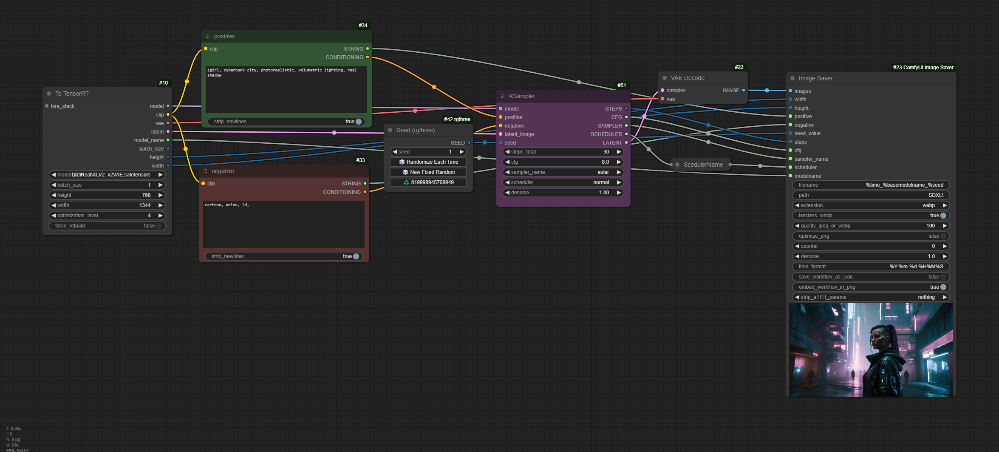

# TensorRT Node for ComfyUI

Notice: _This project is still working in progress, some features are missing, i.e. Lora, etc._

Similar to [https://github.com/comfyanonymous/ComfyUI_TensorRT], but builds 2-3x faster and uses only 2-3GB of VRAM building engine (on default optimization level).

## How to install

1. Clone the repository into `ComfyUI\custom_nodes`
2. Activate virtual environment `ComfyUI\venv\Scripts\activate.bat`
3. Install dependencies `pip install -r requirements.txt --extra-index-url https://pypi.nvidia.com`
4. Start ComfyUI, load example workflow and install missing custom nodes
5. Restart ComfyUI and call it a day

## Differences

- No need to choose model type, auto detected
- No need to separate build and output process
- Customizable optimization level (higher=faster run time but slower and more memory intense on build)
- Memory usage tweaks, (i.e. streamed weight loading, etc.)
- Have all necessary params as output (i.e. `model_name`, `batch_size`, etc.), making it compatible with _Image Saver_

## Screenshot

## Current Issue

- Loras don't work:

- AnimateDiff doesn't work (may be fixed? not checked)

## TODOs

- Add an option to toggle weight streaming for both engine building and inference
- Fix issues above
- Tests for SD3, SD1.5, SD2.1, SDV
- Fixes lora, FreeU, etc.
